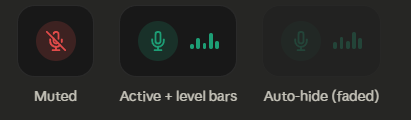
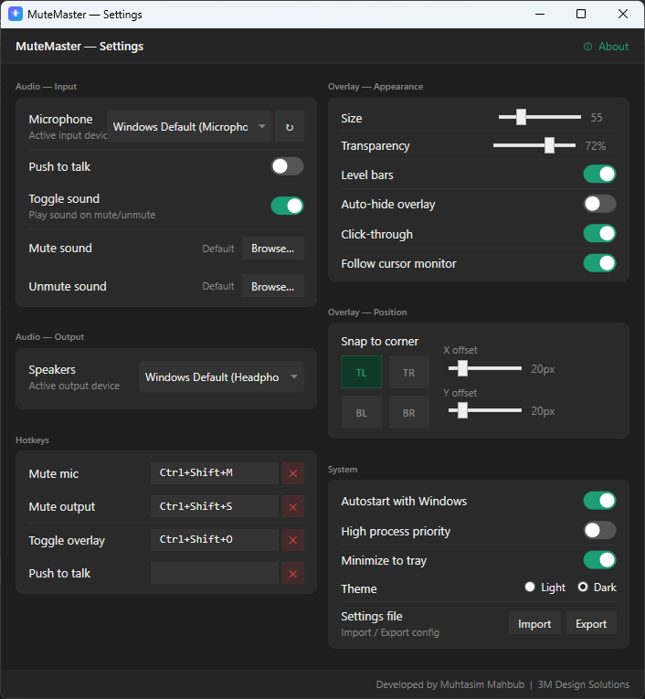
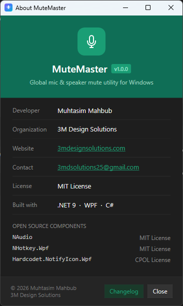

# MuteMaster

> A lightweight Windows utility for instant, system-wide microphone and speaker mute control with a customizable overlay, real-time mic level visualization, and fully configurable hotkeys.


---

## Screenshots







---

## Overview

MuteMaster gives you instant, OS-level control over your microphone and speakers from anywhere on your system, no matter which app is in focus. A minimal always-on-top overlay shows your current mute status at a glance, with real-time mic level bars and fully customizable hotkeys including support for single keys, combos, and mouse side buttons.

Built with .NET 9 and WPF for native Windows performance, MuteMaster runs quietly in your system tray and uses minimal CPU and memory at idle.

---

## Download

**[⬇ Download MuteMaster v1.0.0](https://github.com/mmatul06/MuteMaster/releases/latest)**

Extract the zip and run `MuteMaster.exe`. No installer required.

---

## Features

### Audio Control
- Global microphone mute/unmute: Affects all apps system-wide via Windows Core Audio (WASAPI)
- Global speaker/output device mute/unmute
- Choose specific input and output devices independently, or use Windows Default
- Push to talk mode: Hold a key to unmute, release to remute
- Separate custom sounds for mute and unmute, with built-in default beep

### Overlay
- Minimal, always-on-top semi-transparent overlay showing mic mute status
- Real-time microphone level bars with live pulsing visualization (toggleable)
- Push to talk indicator badge on overlay
- Fully adjustable size and transparency
- Snap to any screen corner (TL, TR, BL, BR) with X/Y offset fine-tuning
- Click-through mode: Overlay never intercepts mouse clicks
- Auto-hide mode: Fades when mic is active, briefly appears on toggle
- Multi-monitor support. Overlay follows cursor to active monitor

### Hotkeys
- Fully customizable hotkeys for mic mute, speaker mute, overlay toggle, and push to talk
- Supports single keys (e.g. `F8`), combos (e.g. `Ctrl+Shift+M`), and mouse side buttons
- Clear button to remove any hotkey instantly
- All hotkeys work globally regardless of which application is in focus

### Settings
- Clean single-page settings window; Light and Dark theme
- Refresh button to detect newly connected audio devices
- Import and export full settings as a JSON config file
- Minimize to system tray on close
- Autostart with Windows
- High process priority mode
- Double-click tray icon to open settings

---

## Default Hotkeys

| Action | Default |
|---|---|
| Mute / unmute microphone | `Ctrl+Shift+M` |
| Mute / unmute speakers | `Ctrl+Shift+S` |
| Toggle overlay visibility | `Ctrl+Shift+O` |
| Push to talk | Unset |

All hotkeys are fully remappable in Settings.

---

## Installation

1. Go to [Releases](https://github.com/mmatul06/MuteMaster/releases)
2. Download `MuteMaster-v1.0.0-win-x64.zip`
3. Extract the zip to any folder (e.g. `C:\Tools\MuteMaster\`)
4. Run `MuteMaster.exe`
5. MuteMaster appears in your system tray. Right-click for options or double-click to open Settings

Settings are saved automatically to `%AppData%\MuteMaster\settings.json`.

---

## Requirements

| Component | Requirement |
|---|---|
| Operating System | Windows 10 or Windows 11 (64-bit) |
| Architecture | x64 |
| Runtime | None (self-contained) |
| RAM | ~10 MB at idle |
| Disk Space | ~180 MB (includes bundled runtime) |

---

## Building from Source

### Prerequisites
- Visual Studio 2022 or later
- .NET 9 SDK

### Steps

```bash
git clone https://github.com/mmatul06/MuteMaster.git
cd MuteMaster
dotnet build
dotnet run
```

### NuGet Dependencies

| Package | Purpose |
|---|---|
| NAudio | WASAPI audio control, mic level monitoring |
| NHotkey.Wpf | Global hotkey registration |
| Hardcodet.NotifyIcon.Wpf | System tray icon |

---

## Open Source Acknowledgements

| Library | License |
|---|---|
| [NAudio](https://github.com/naudio/NAudio) | MIT License |
| [NHotkey.Wpf](https://github.com/thomaslevesque/NHotkey) | MIT License |
| [Hardcodet.NotifyIcon.Wpf](https://github.com/hardcodet/wpf-notifyicon) | CPOL License |

---

## License

This project is licensed under the [MIT License](LICENSE).

© 2026 Muhtasim Mahbub. All rights reserved.

---

## Author

**Muhtasim Mahbub**  
3M Design Solutions  
🌐 [3mdesignsolutions.com](https://3mdesignsolutions.com)  
📧 [3mdsolutions25@gmail.com](mailto:3mdsolutions25@gmail.com)

---

*If MuteMaster is useful to you, consider giving it a ⭐ on GitHub!*
